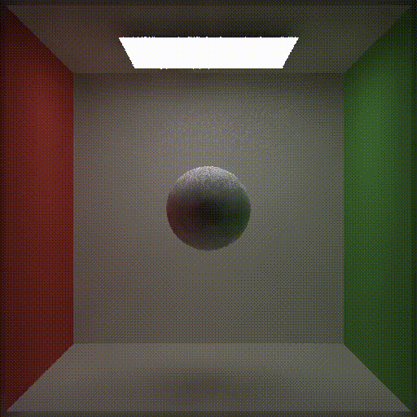

# GAMES-202-Homework

---

# Homework1（Shadows）

---

## 基础 Shadow Mapping 效果

## PCF 效果

## PCSS 效果

# Homework2（SH Lighting）

---

## SH Lighting Unshadowed 效果

## SH Lighting Shadowed 效果

## SH Lighting Shadowed & Interreflection 效果

## SH Rotation 效果

# Homework3（Screen Space Ray Tracing）

---

## Screen Space Ray Tracing 效果

# Homework4（PBR）

## Microfacet BRDF 效果

## Microfacet BRDF & Kulla-Conty 效果

# Homework5（Denoise）

---

## TAA 效果

## 联合双边滤波效果

## 联合双边滤波 & TAA 终效果

